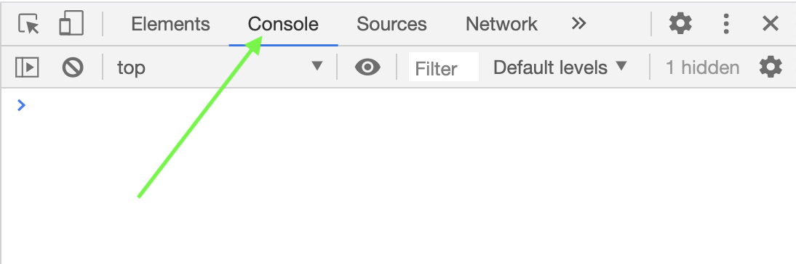

# In-browser JavaScript Functions

## Overview
- This lesson will guide you in creating a funciton that displays a greeting to whoever the user is. 

## Learning Objectives
- Getting experience using the Chrome developer tools
- Understanding the purpose of creating reusable code
- Practicing the use of built-in JavaScript methods, especially prompt and alert

## Vocabulary
- Chrome Developer Tools
- function
- argument
- prompt
- alert
- variable
- function call

## Additional Resources
- <a href="https://developer.mozilla.org/en-US/docs/Web/JavaScript/Reference/Global_Objects/Function" target="_blank">JavaScript Functions</a>
- <a href="https://developer.mozilla.org/en-US/docs/Web/JavaScript/Reference/Statements/var" target="_blank">JavaScript Variables</a>

## Set-up
- Open up Google Chrome
- Right-click anywhere on any webpage
- Click "inspect"
- Click "Console"


## Functions
A function is a set of instructions detailing how to do a task. We can use the instructions to build something over and over again, in the same way that one blueprint can be used many times to build many buildings.

It is important to remember that there is a difference between a **function declaration** - creating the instructions, and a **function call** - following the instructions to perform a task.

For example, look at this **function declaration:**

```javascript
var welcome = () => {
  alert("Welcome to the internet!")
}
````

Notice the pieces of a function:

1.  Assigning a function to a variable: `var`
2.  The name of the function: `welcome`
3.  Parentheses which can also take 'arguments': `()`
4.  The fat arrow syntax: `=>`
5.  Opening curly bracket: `{`
6.  A set of instructions inside the curly brackets: `alert("Welcome to the internet!")`
7.  Closing curly bracket: `}`


Great! We have a function. But this function has not yet been used in our program because we do not have a function call.  A **function call** looks like this....

```javascript
welcome()
--> Welcome to the internet!
```

Notice that we used the same name that we gave our variable that points to the function. Calling the function by its name will tell the program to run through the steps declared in the greeting function.

## Function Arguments
Functions often require external information in order to run. Pieces of outside information that is used when a function runs are called **arguments** to that function.  We put the arguments inside the parentheses of the function.

Let's build a multiplyBy2() function to make it a little more versatile by allowing it to take in a name as an argument.

```javascript
const multiplyBy2 = (number) => {
  alert(number * 2)
}

console.log(multiplyBy2(4))
--> 8
```
Notice that in the function we created a **placeholder** called `number`. This allows us to pass any name we want through the function during the function call.

The function is an encapsulated machine that can be called many times and give a unique output.

```javascript
multiplyBy2(7)
--> 14
multiplyBy2(10)
--> 20
multiplyBy2(3)
--> 6
```
